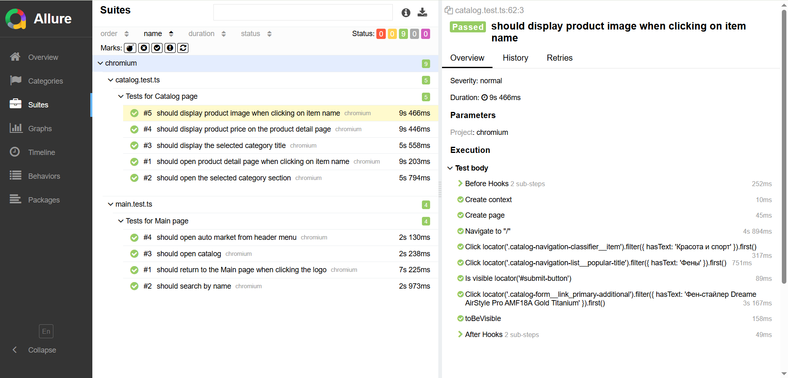

# 🎓 Дипломный проект по автоматизации тестирования

## **Mocha · Jest · Playwright · TypeScript**


  


Дипломный проект включает автоматизацию Unit, API и UI тестирования с использованием современных инструментов: Mocha, Jest, Playwright и Allure

---

## 📌 Содержание

- [📋 Чек-лист тестов](#cases)
- [🛠️ Стек технологий](#stack)
- [⚙️ Подготовка к запуску](#setup)
- [🚀 Запуск автотестов](#autotests)
- [📊 Генерация Allure-отчетов](#generateAllureReport)
- [📑 Пример Allure-отчета](#allureReport)
- [👤 Автор](#author)

---

<a id="cases"></a>

## 📋 Чек-лист автоматизированных тестов

### ✅ Task 1: Unit-тесты (Mocha)

- Реализован класс формы регистрации с методами валидации полей
- Покрытие полей: `firstName`, `lastName`, `email`, `password`, `confirmPassword`
- ✔️ 15 позитивных кейсов
- ❌ 15 негативных кейсов
- Проверка:
  - Валидации email и пароля
  - Соответствия пароля и подтверждения
  - Обязательных полей
  - Формы в целом

---

### ✅ Task 2: API тесты (Jest + SuperAgent)

Протестировано публичное REST API: [jsonplaceholder.typicode.com](https://jsonplaceholder.typicode.com)

- ✔️ 5 тестов для каждого метода:
  - `GET` — получение постов, по ID, несуществующих ID и пр.
  - `POST` — создание поста, с валидными/невалидными данными
  - `PUT` — полное обновление поста
  - `PATCH` — частичное обновление
  - `DELETE` — удаление постов (валидных и невалидных)

---

### ✅ Task 3: UI тесты сайта [onliner.by](https://www.onliner.by) (Playwright)

- Покрытие включает:
- ✔️ Проверка поиска на главной странице
- ✔️ Переход в каталог
- ✔️ Переход по категориям и разделам
- ✔️ Открытие страницы товара
- ✔️ Отображение цены и фото товара
- ✔️ Переход по логотипу
- Используются:
  - Page Object
  - Page Factory
- Использованы разные типы **селекторов**: CSS, текстовые, атрибутные
- Добавлена интеграция с **Allure Reporter**

---

<a id="stack"></a>

## 🛠️ Стек технологий

- [Jest](https://jestjs.io/) - фреймворк для тестирования API
- [SuperAgent](https://visionmedia.github.io/superagent/) - библиотека для выполнения HTTP-запросов
- [Playwright](https://playwright.dev/) – фреймворк для тестирования UI
- [Mocha](https://mochajs.org/) - фреймворк для юнит-тестирования на JavaScript
- [Node.js](https://nodejs.org/) – среда выполнения JavaScript
- [Allure Report](https://docs.qameta.io/allure/) – система отчетности
- [npm](https://www.npmjs.com/) – менеджер пакетов

---

<a id="setup"></a>

## ⚙️ Подготовка к запуску

1️⃣ Установить Node.js (версия 22+) с [официального сайта](https://nodejs.org/)  
2️⃣ Склонировать проект  
3️⃣ Локально установить все необходимые пакеты через команду npm ci

---

<a id="autotests"></a>

## 🚀 Запуск автотестов

Запуск UI тестов

```bash
npm run test:playwright
```

Запуск API тестов

```bash
npm run test:jest
```

Запуск unit тестов

```bash
npm run test:mocha
```

---

<a id="generateAllureReport"></a>

## 📊 Генерация Allure отчетов

```bash
npm run allure:reporter
```

---

<a id="allureReport"></a>

## 📑 Пример Allure отчета



---

<a id="author"></a>

## 👤 Автор

Стрельчёнок Надежда
